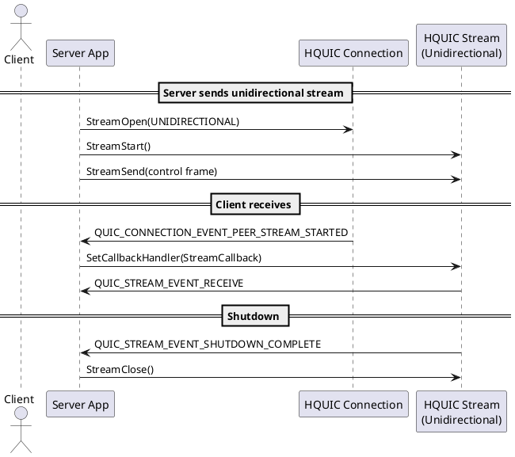
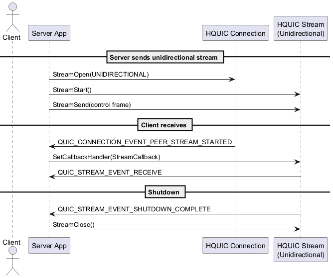


# 📘 MkDocs-Style PlantUML Diagram System

### Designed for Enterprise Engineering Documentation Pipelines

---

## 1. 🧭 Concept Overview

Engineering teams often need to express architecture, sequences, and data flows through diagrams. However, maintaining consistency across development environments, GitHub previews, and published docs requires:

* **Diagram source control** (`.puml`)
* **Auto-generation of visuals** (`.png`, `.svg`)
* **MkDocs-compatible folder structure**
* **Developer-friendly tooling** (e.g., PowerShell for Windows-based engineers)
* **Reproducibility across CI and local systems**

This document introduces a fully structured, cross-platform-compatible method to generate and manage PlantUML diagrams for enterprise use.

---

## 2. 📁 Project Folder Structure

```
my-repo/
├── mkdocs.yml                      # MkDocs configuration file
├── docs/                           # MkDocs documentation root
│   ├── index.md
│   ├── architecture.md             # Example usage
│   ├── diagrams/                   # Source `.puml` files
│   │   └── login-flow.puml
│   ├── images/                     # Generated `.png` files
│   │   └── login-flow.png
│   ├── svg/                        # Generated `.svg` files
│   │   └── login-flow.svg
├── generate-diagrams.ps1          # PowerShell script for diagram generation
├── plantuml.jar                   # PlantUML CLI jar (downloaded)
```

---

## 3. 🔧 Setup Prerequisites

### 3.1 Install Java Runtime

* Required for running `plantuml.jar`
* Download from [Adoptium](https://adoptium.net/) or install via package manager

### 3.2 Download `plantuml.jar`

* [Official download link](https://plantuml.com/download)
* Place `plantuml.jar` in your repo root or next to the PowerShell script

### 3.3 Install Graphviz

* Needed for rendering component and sequence diagrams
* Windows: [https://graphviz.org/download/](https://graphviz.org/download/)
* Add Graphviz `bin/` folder to your PATH

---

## 4. 🧪 PowerShell Script: `generate-diagrams.ps1`

### Purpose

* Converts all `.puml` files from `docs/diagrams/` into:

  * `.png` in `docs/images/`
  * `.svg` in `docs/svg/`

### Script

```powershell
# generate-diagrams.ps1

$ErrorActionPreference = "Stop"

$basePath = "$PSScriptRoot/docs"
$pumlPath = Join-Path $basePath "diagrams"
$pngPath  = Join-Path $basePath "images"
$svgPath  = Join-Path $basePath "svg"
$plantumlJar = "plantuml.jar"

New-Item -ItemType Directory -Force -Path $pngPath | Out-Null
New-Item -ItemType Directory -Force -Path $svgPath | Out-Null

if (-not (Test-Path $plantumlJar)) {
    Write-Error "Missing plantuml.jar. Download from: https://plantuml.com/download"
    exit 1
}

if (-not (Get-Command java -ErrorAction SilentlyContinue)) {
    Write-Error "Java is not installed or not in PATH."
    exit 1
}

Get-ChildItem -Path $pumlPath -Filter "*.puml" -Recurse | ForEach-Object {
    $file = $_.FullName
    $filename = $_.BaseName

    Write-Host "Rendering $filename..."

    java -jar $plantumlJar -tpng $file -o $pngPath
    java -jar $plantumlJar -tsvg $file -o $svgPath
}

Write-Host "`n✅ Diagrams generated in:"
Write-Host " - PNG: $pngPath"
Write-Host " - SVG: $svgPath"
```

---

## 5. 🧼 Common Pitfalls and Fixes

| Issue              | Cause/Resolution                   |
| ------------------ | ---------------------------------- |
| `No diagram found` | - File missing `@startuml/@enduml` |

```
                                      - Folder typo (`digram` instead of `diagrams`)  
                                      - UTF-8 **with BOM** encoding (Visual Studio default)                          |
```

\| PlantUML command works online, not CLI | - File saved with BOM. Use "Save with Encoding" → UTF-8 without BOM in VS 2022.  |
\| Diagrams not rendering in GitHub       | GitHub only supports `.png`, not inline `.svg`                                   |
\| PowerShell script fails to run         | Update execution policy:
`Set-ExecutionPolicy -Scope CurrentUser -ExecutionPolicy RemoteSigned` |

---

## 6. 🧾 Example Diagram `.puml`



---
## Unidirectional Stream Lifecycle



[🔍 View SVG](svg/unidirectional-stream-lifecycle.svg)  
[🧾 View Source (.puml)](diagrams/unidirectional-stream-lifecycle.puml)

## 7. 🧱 Markdown Usage in `docs/*.md`

```markdown
## Unidirectional Stream Lifecycle


[🔍 View SVG](svg/unidirectional-stream-lifecycle.svg)  
[🧾 View Source (.puml)](diagrams/unidirectional-stream-lifecycle.puml)
```

---

## 8. 🧪 Local MkDocs Preview

### Install MkDocs (Python required)

```bash
pip install mkdocs
```

### Run locally:

```bash
mkdocs serve
```

Visit: [http://localhost:8000](http://localhost:8000)

---

## 9. 🚀 Optional GitHub Pages Deployment

In `mkdocs.yml`:

```yaml
site_name: My Project Docs
nav:
  - Home: index.md
  - Architecture: architecture.md
```

Deploy:

```bash
mkdocs gh-deploy
```

---

## ✅ Summary

This workflow enables consistent documentation with versioned `.puml` sources, automatically generated `.png` and `.svg` diagrams, and clean Markdown usage in a MkDocs structure — fully compatible with local development, GitHub previews, and public publishing.

It encapsulates:

* Clear file organization
* Dev-friendly PowerShell automation
* PlantUML and Graphviz integration
* Cross-environment consistency
* Common failure diagnostics

