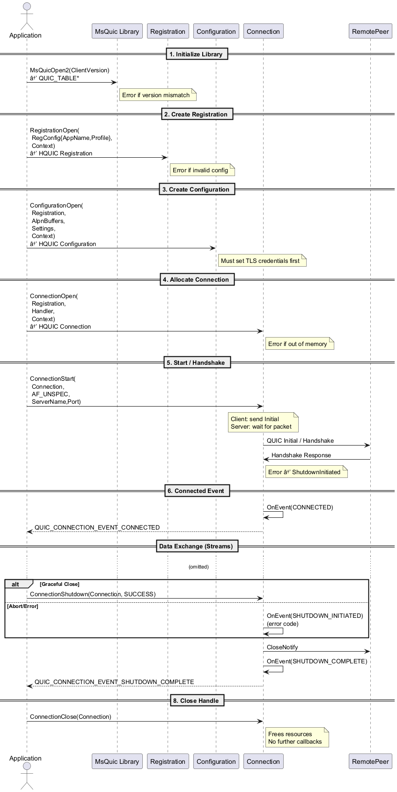
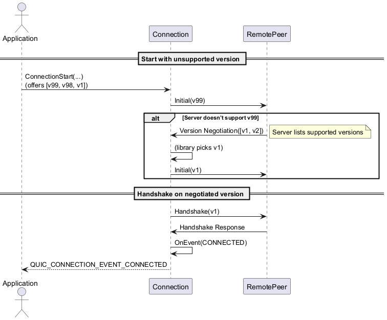
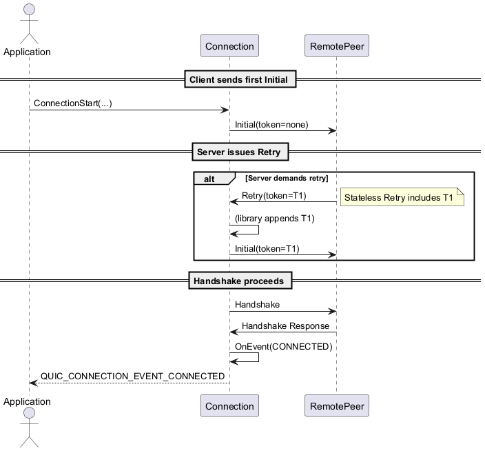
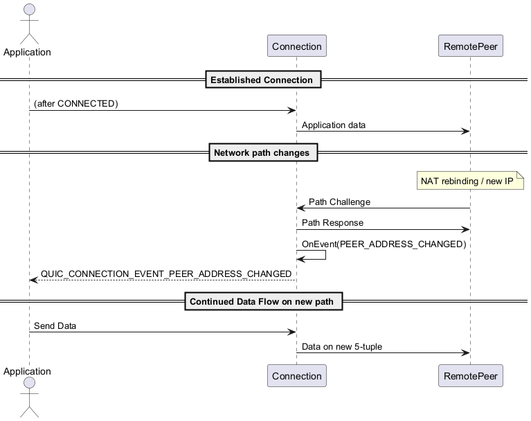
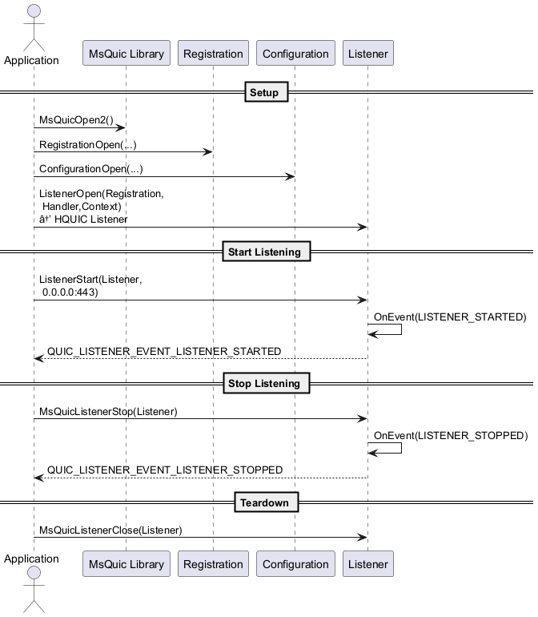
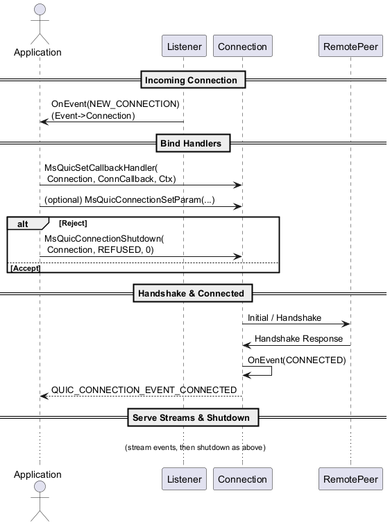

# Section 1:  Connections

## 1. MsQuicOpen2

**Purpose:** Initialize the library and retrieve the function table.
**API:**

```cpp
QUIC_STATUS
MsQuicOpen2(
    _In_ uint32_t ClientVersion,
    _Out_ const QUIC_TABLE** QuicLib
    );
```

* **ClientVersion**: Pass `MSQUIC_API_VERSION_2` (or higher).
* **QuicLib**: On success, points to a table of function pointers (`MsQuic`, `RegistrationOpen`, etc.).
* **Error paths**: Returns `QUIC_STATUS_NOT_SUPPORTED` if version mismatch, or `QUIC_STATUS_VER_NEG_ERROR` if negotiation fails.

> Once you have `QuicLib`, all subsequent calls go through that table.

---

## 2. RegistrationOpen

**Purpose:** Create a “registration” object grouping your connections under an app identity.
**API:**

```cpp
QUIC_STATUS
RegistrationOpen(
    _In_ const QUIC_REGISTRATION_CONFIG* RegConfig,
    _In_ void* Context,
    _Out_ HQUIC* RegistrationHandle
    );
```

* **RegConfig**:

  * `AppName`: A null-terminated string identifying your application.
  * `ExecutionProfile`: e.g. `QUIC_EXECUTION_PROFILE_LOW_LATENCY`.
* **Context**: User pointer passed to all callbacks.
* **RegistrationHandle**: Returned handle for future calls.
* **Error paths**: Fails if you call before `MsQuicOpen2` or pass invalid config.

---

## 3. ConfigurationOpen

**Purpose:** Bind TLS, ALPN, congestion, and transport settings to your registration.
**API:**

```cpp
QUIC_STATUS
ConfigurationOpen(
    _In_ HQUIC Registration,
    _In_ const QUIC_BUFFER* AlpnBuffers,
    _In_ uint32_t AlpnBufferCount,
    _In_ const QUIC_SETTINGS* Settings,
    _In_ uint32_t SettingsBufferLength,
    _In_opt_ void* Context,
    _Out_ HQUIC* ConfigurationHandle
    );
```

* **AlpnBuffers**: Array of ALPN strings (e.g. `"h3"` or custom).
* **Settings**:

  * `IdleTimeoutMs`, `DesiredMaxBytesPerKey`, etc.
* **Context**: Optional pointer for config-level callbacks.
* **ConfigurationHandle**: Use this when starting connections or listeners.
* **Error paths**: Fails if TLS credential isn’t loaded, or ALPN is unsupported.

> You must call `SetParam` (e.g. for `QUIC_PARAM_GLOBAL_TLS_CREDENTIAL_CONFIG`) *before* `ConfigurationOpen`.

---

## 4. ConnectionOpen

**Purpose:** Allocate a new connection and register your event callback.
**API:**

```cpp
QUIC_STATUS
ConnectionOpen(
    _In_ HQUIC Registration,
    _In_ QUIC_CONNECTION_CALLBACK_HANDLER Handler,
    _In_opt_ void* Context,
    _Out_ HQUIC* ConnectionHandle
    );
```

* **Registration**: The handle from step 2.
* **Handler**: Your function receiving `QUIC_CONNECTION_EVENT` callbacks (e.g. `CONNECTED`, `SHUTDOWN`).
* **Context**: User pointer for per-connection state.
* **ConnectionHandle**: Returned handle, opaque until closed.
* **Error paths**: Fails if registration is invalid or out of memory.

---

## 5. ConnectionStart

**Purpose:** Kick off the handshake (Client) or await an incoming packet (Server).
**API:**

```cpp
QUIC_STATUS
ConnectionStart(
    _In_ HQUIC Connection,
    _In_ QUIC_ADDRESS_FAMILY Family,
    _In_ const char* ServerName,
    _In_ uint16_t ServerPort
    );
```

* **Connection**: From step 4.
* **Family**: `QUIC_ADDRESS_FAMILY_UNSPEC` or specific (IPv4/IPv6).
* **ServerName/Port**: DNS name and port of the peer.
* **Behavior**:

  * **Client**: Sends Initial + Handshake packets.
  * **Server**: Passive—first incoming packet triggers `HANDSHAKE_RECEIVED`.
* **Error paths**: Immediate failure if DNS lookup fails or parameters invalid.

---

## 6. Connected Callback

**Purpose:** Signal that the handshake has completed successfully (or failed).
**Callback Event:**

```cpp
case QUIC_CONNECTION_EVENT_CONNECTED:
    // Connection->Context now fully established
    break;
```

* **When fired**: After 1-RTT handshake success.
* **Data**: Contains negotiated ALPN, peer transport parameters.
* **Error paths**: If handshake fails, you’ll see `QUIC_CONNECTION_EVENT_SHUTDOWN_INITIATED` with a non-zero error code instead.

---

## 7. Shutdown & Error Handling

**Purpose:** Close the QUIC connection gracefully or in response to errors.

### a) Graceful Shutdown

```cpp
MsQuicConnectionShutdown(
    Connection,
    QUIC_STATUS_SUCCESS,
    0 // Application close code
    );
```

* Fires `QUIC_CONNECTION_EVENT_SHUTDOWN_INITIATED` → send CloseNotify.
* Then `QUIC_CONNECTION_EVENT_SHUTDOWN_COMPLETE` when peer ack’s closure.

### b) Abortive / Error Shutdown

```cpp
MsQuicConnectionShutdown(
    Connection,
    QUIC_STATUS_NETWORK_INTERRUPT,
    0
    );
```

* Use non-zero status to indicate errors (e.g. `QUIC_STATUS_INTERNAL_ERROR`).
* Same sequence of events, but peers see an error code.

---

## 8. ConnectionClose

**Purpose:** Tear down the handle and release all resources.
**API:**

```cpp
MsQuicConnectionClose(
    _In_ HQUIC Connection
    );
```

* **Precondition:** Should only be called *after* `QUIC_CONNECTION_EVENT_SHUTDOWN_COMPLETE`.
* **No callbacks** fire afterward.
* Frees all memory and stops any pending retries.



[🔍 View SVG](svg/connections-sequence.svg)  
[🧾 View Source (.puml)](diagrams/connections-sequence.puml)

---

## Version Negotiation

When a client and server do not initially agree on a QUIC version, the server sends a Version Negotiation packet. MsQuic’s library handles the low-level wire logic, automatically retrying with a supported version. From your application’s perspective, you simply call `MsQuicConnectionStart()`, and the library transparently retries under the hood until the handshake can proceed.

**Key APIs & Events**

1. **ConnectionOpen** → `QUIC_CONNECTION_EVENT_CONNECTED` only fires once a supported version is negotiated and the handshake completes.
2. **ConnectionStart** → embeds your offered versions in the Initial packet.
3. **Internal Retry** → no application callback; the library resends Initial with negotiated version after receiving Version Negotiation.



[🔍 View SVG](svg/connections-version-negotions-sequence.svg)  
[🧾 View Source (.puml)](diagrams/connections-version-negotions-sequence.puml)

---

## Stateless Retry

Stateless Retry enforces source-address validation. On the first Initial packet, the server responds with a Retry containing a token. The client must resend its Initial including that token, at which point the server proceeds with the handshake.

**Key APIs & Events**

1. **ConfigurationOpen** → ensure `RetryEnabled` is true in `QUIC_SETTINGS`.
2. **ConnectionStart** → send Initial (no token).
3. **Internal Library Handling** → upon Retry packet, library resends Initial with token automatically.
4. **Connected Callback** → application sees only a single `CONNECTED` event when handshake succeeds.



[🔍 View SVG](svg/connections-stateless-retry-sequence.svg)  
[🧾 View Source (.puml)](diagrams/connections-stateless-retry-sequence.puml)

---

## Connection Migration

QUIC connections can survive changes in the client’s IP or port (e.g., NAT rebinding or network failover). MsQuic exposes these changes via an event so the application can react (e.g., by updating peer address parameters or logging).

**Key APIs & Events**

1. **QUIC\_CONNECTION\_EVENT\_PEER\_STREAM\_STARTED** – not related.
2. **Internal Path Probing** – library automatically probes the new path.
3. **QUIC\_CONNECTION\_EVENT\_PEER\_ADDRESS\_CHANGED** – callback to application.
4. **Optional**: call `MsQuicConnectionSetParam(Connection, QUIC_PARAM_CONN_REMOTE_ADDRESS, …)` if you need to override the endpoint.



[🔍 View SVG](svg/connections-migration-sequence.svg)  
[🧾 View Source (.puml)](diagrams/connections-migration-sequence.puml)

---

Parameter-by-API breakdown for the eight core MsQuic connection calls covered, followed by an in-depth look at advanced retry policies and when you might tune them.

## API Parameter Reference

| API                          | Parameter              | Type                               | Description                                                                                |
| ---------------------------- | ---------------------- | ---------------------------------- | ------------------------------------------------------------------------------------------ |
| **MsQuicOpen2**              | `ClientVersion`        | `uint32_t`                         | Version constant your app was built against (e.g. `MSQUIC_API_VERSION_2`).                 |
|                              | `QuicLib`              | `const QUIC_TABLE**`               | OUT: pointer to the function-pointer table you’ll use for all other calls.                 |
| **RegistrationOpen**         | `RegConfig`            | `const QUIC_REGISTRATION_CONFIG*`  | App identity (`AppName`, `ExecutionProfile`).                                              |
|                              | `Context`              | `void*`                            | User pointer passed verbatim into every connection callback.                               |
|                              | `RegistrationHandle`   | `HQUIC*`                           | OUT: registration handle for grouping connections.                                         |
| **ConfigurationOpen**        | `Registration`         | `HQUIC`                            | Handle returned by `RegistrationOpen`.                                                     |
|                              | `AlpnBuffers`          | `const QUIC_BUFFER*`               | Array of ALPN identifiers (e.g. `"h3"`).                                                   |
|                              | `AlpnBufferCount`      | `uint32_t`                         | Number of entries in `AlpnBuffers`.                                                        |
|                              | `Settings`             | `const QUIC_SETTINGS*`             | Transport/TLS settings (timeouts, flow-control, retry enable, etc.).                       |
|                              | `SettingsBufferLength` | `uint32_t`                         | Size of the `QUIC_SETTINGS` struct blob in bytes.                                          |
|                              | `Context`              | `void*`                            | Optional; config-specific context passed to credential callbacks.                          |
|                              | `ConfigurationHandle`  | `HQUIC*`                           | OUT: configuration handle to use when starting connections or listeners.                   |
| **ConnectionOpen**           | `Registration`         | `HQUIC`                            | Registration handle from above.                                                            |
|                              | `Handler`              | `QUIC_CONNECTION_CALLBACK_HANDLER` | Your callback for all connection events (CONNECTED, SHUTDOWN, MIGRATE, etc.).              |
|                              | `Context`              | `void*`                            | Per-connection state pointer, delivered in every callback.                                 |
|                              | `ConnectionHandle`     | `HQUIC*`                           | OUT: opaque connection handle you’ll pass to start/shutdown/close.                         |
| **MsQuicConnectionStart**    | `Connection`           | `HQUIC`                            | Handle returned by `ConnectionOpen`.                                                       |
|                              | `Family`               | `QUIC_ADDRESS_FAMILY`              | Address family (`UNSPEC`, `INET`, `INET6`).                                                |
|                              | `ServerName`           | `const char*`                      | DNS SNI for server authentication (client only).                                           |
|                              | `ServerPort`           | `uint16_t`                         | UDP port on which the peer is listening.                                                   |
| **MsQuicConnectionShutdown** | `Connection`           | `HQUIC`                            | Your connection handle.                                                                    |
|                              | `Flags`                | `QUIC_CONNECTION_SHUTDOWN_FLAGS`   | e.g. `NONE` vs. `SILENT`.                                                                  |
|                              | `ErrorCode`            | `uint64_t`                         | Application or error status (0 for graceful).                                              |
| **MsQuicConnectionClose**    | `Connection`           | `HQUIC`                            | Connection handle to free. Should be called *after* you see the `SHUTDOWN_COMPLETE` event. |

---

## Advanced Retry Policies

QUIC’s built-in retry mechanisms (stateless retry & version negotiation) live in the transport layer and are handled automatically by MsQuic. However, you can tune *when* and *how often* these retries occur via a few knobs in your `QUIC_SETTINGS`:

| Setting                         | Description                                                                          |
| ------------------------------- | ------------------------------------------------------------------------------------ |
| `RetryMemory`                   | Maximum bytes of state server will keep for stateless retry tokens.                  |
| `StatelessRetryEnabled`         | Toggle server’s stateless retry logic on/off.                                        |
| `HandshakeIdleTimeoutMs`        | How long the peer has to complete handshake before retry/timeout.                    |
| `DisconnectTimeoutMs`           | How long to wait for peer to react to closure before aborting.                       |
| `MaxPacketRetryCount` (RTT cfg) | Number of times Initial or Handshake packets will be retransmitted before giving up. |
| `InitialRttMs`                  | The base RTT estimate to start pacing & backoff calculations.                        |
| `LossDetectionGracePeriodMs`    | Delay before declaring handshake lost and retrying.                                  |

> *Note:* exact field names live in `QUIC_SETTINGS` and may have slightly different identifiers; consult [`msquic.h`](https://github.com/microsoft/msquic/blob/release/2.4/src/inc/msquic.h) for the definitive list.

### When to Tune Retry Policies

1. **High-Loss Environments (e.g., cellular, satellite)**

   * **Why**: Packet loss rates may spike, causing handshake packets (Initial/Handshake) to drop.
   * **Tune**: Increase `MaxPacketRetryCount` and `HandshakeIdleTimeoutMs` so the client retries more aggressively before giving up.

2. **Long-Latency Links**

   * **Why**: RTT may be large (hundreds of ms), so default pacing/backoff may wait too long.
   * **Tune**: Raise `InitialRttMs` to better reflect the observed RTT and reduce early retransmission delays.

3. **Server Load & Stateless Retry**

   * **Why**: Avoid back-pressure under DDoS or massive influx of new connections.
   * **Tune**:

     * Enable `StatelessRetryEnabled` so malicious clients must return a token before the full handshake.
     * Adjust `RetryMemory` to limit how many tokens the server stores, bounding memory footprint.

4. **Graceful Draining / Connection Quiesce**

   * **Why**: During application shutdown or rolling upgrades, you may want existing connections to persist longer.
   * **Tune**: Increase `DisconnectTimeoutMs` so peers have more time to finish in-flight streams before closure.

5. **Interoperability Testing**

   * **Why**: Some middleboxes aggressively drop or tamper with QUIC handshake packets.
   * **Tune**:

     * Lower `HandshakeIdleTimeoutMs` to fail fast on broken paths.
     * Use external probes or logging to detect which packet (Initial vs. Handshake) is lost and adjust backoff.

---

# Section 2: Listener Lifecycle

A QUIC **listener** binds to a UDP port and dispatches incoming Initial packets to new connection objects. Below are the core steps and APIs:

1. **MsQuicOpen2**

   * Initialize the library (same as Section 1).

2. **RegistrationOpen**

   * Register your app identity (same as Section 1).

3. **ConfigurationOpen**

   * Create a server configuration: you must set up TLS credential via `MsQuicConfigurationSetParam` before calling this.

4. **ListenerOpen**

   ```cpp
   QUIC_STATUS
   MsQuicListenerOpen(
       _In_ HQUIC Registration,
       _In_ QUIC_LISTENER_CALLBACK_HANDLER Handler,
       _In_opt_ void* Context,
       _Out_ HQUIC* ListenerHandle
       );
   ```

   * **Registration**: from `RegistrationOpen`.
   * **Handler**: receives `QUIC_LISTENER_EVENT` callbacks (`NEW_CONNECTION`, `LISTENER_STOPPED`, etc.).
   * **Context**: user pointer for listener-level state.
   * **ListenerHandle**: opaque handle returned on success.
   * **Errors**: invalid registration or OOM.

5. **ListenerStart**

   ```cpp
   QUIC_STATUS
   MsQuicListenerStart(
       _In_ HQUIC Listener,
       _In_ const QUIC_ADDR* LocalAddress
       );
   ```

   * **LocalAddress**: UDP IP/port to bind (e.g. `0.0.0.0:443`).
   * **Errors**: address-in-use, insufficient privileges.

6. **OnEvent(LISTENER\_STARTED)**

   * Event `QUIC_LISTENER_EVENT_LISTENER_STARTED` signals the UDP socket is bound and ready.

7. **OnEvent(LISTENER\_STOPPED)**

   * Event `QUIC_LISTENER_EVENT_LISTENER_STOPPED` signals the listener was stopped (e.g., after `MsQuicListenerStop` or error).

8. **MsQuicListenerClose**

   ```cpp
   void
   MsQuicListenerClose(
       _In_ HQUIC Listener
       );
   ```

   * Frees the listener handle. No further callbacks fire.

### Listener Lifecycle Sequence Diagram



[🔍 View SVG](svg/listener-lifecycle-sequence.svg)  
[🧾 View Source (.puml)](diagrams/listener-lifecycle-sequence.puml)

---

# Section 3: Server-Side Accept Callbacks

When a peer’s Initial packet arrives, the listener emits a **NEW\_CONNECTION** event. Your callback can accept or reject the incoming connection and must set up per-connection handlers.

1. **QUIC\_LISTENER\_EVENT\_NEW\_CONNECTION**

   * Fired in your listener callback:

     ```cpp
     case QUIC_LISTENER_EVENT_NEW_CONNECTION: {
         HQUIC NewConnection = Event->NEW_CONNECTION.Connection;
         void* NewContext      = /* allocate per-conn state */;
         // … see steps 2–4 …
     }
     ```

2. **MsQuicSetCallbackHandler**

   ```cpp
   MsQuicSetCallbackHandler(
       NewConnection,
       (void*)YourConnectionCallback,
       NewContext
       );
   ```

   * Binds `YourConnectionCallback` to handle `QUIC_CONNECTION_EVENT_*` for this connection.

3. **Optional: SetParam for TLS / Transport**

   * If you have per-connection overrides, call e.g.:

     ```cpp
     MsQuicConnectionSetParam(
         NewConnection,
         QUIC_PARAM_CONN_LOCAL_CID_PREFIX,
         sizeof(Prefix),
         &Prefix
     );
     ```

4. **Accept or Reject**

   * **Accept**: Do nothing further; MsQuic will proceed with handshake using the listener’s `Configuration`.
   * **Reject**:

     ```cpp
     MsQuicConnectionShutdown(
         NewConnection,
         QUIC_STATUS_CONNECTION_REFUSED,
         0
     );
     ```

5. **OnEvent(CONNECTED)**

   * Your `QUIC_CONNECTION_EVENT_CONNECTED` fires once handshake succeeds.

6. **Stream & Data Events**

   * Handle `QUIC_CONNECTION_EVENT_PEER_STREAM_STARTED`, `SHUTDOWN_INITIATED`, etc., in your connection callback.

7. **Shutdown & Close**

   * Gracefully shutdown:

     ```cpp
     MsQuicConnectionShutdown(NewConnection, QUIC_STATUS_SUCCESS, 0);
     ```
   * After `SHUTDOWN_COMPLETE`, free:

     ```cpp
     MsQuicConnectionClose(NewConnection);
     ```

8. **Error Paths**

   * On invalid ALPN, certificate mismatch, or protocol error, MsQuic will auto-initiate shutdown with an error code before you see `CONNECTED`.

### Server Accept Sequence Diagram



[🔍 View SVG](svg/server-accept-sequence.svg)  
[🧾 View Source (.puml)](diagrams/server-accept-sequence.puml)

---
