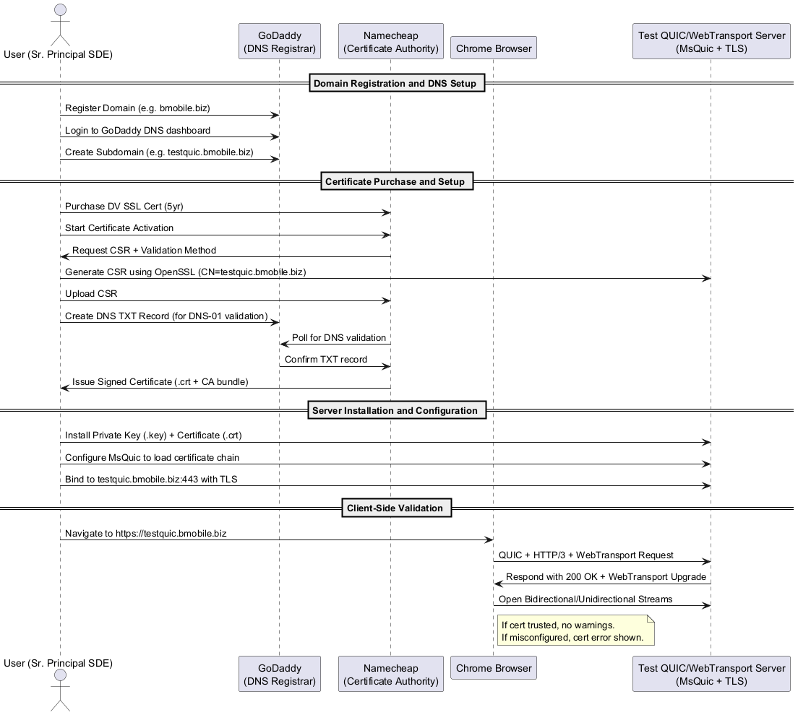


# Overview
The following is representive of a process followed to enable a clean test model between Chrome and a QUIC test service via WebTransport.  Because of the enhanced security built into the browser and QUIC itself, starting with a domain and dv certs is the best approach even in pure dev/experimentation.  Trying this with self-siged local certs is problematic at best.



[🔍 View SVG](svg/end-to-end-process-sequence.svg)  
[🧾 View Source (.puml)](diagrams/end-to-end-process-sequence.puml)

## 🧭 Full Step-by-Step Walkthrough: End-to-End Certificate and WebTransport Setup

### 🟩 1. **Register a Domain on GoDaddy**

#### ✅ Steps:

* Visit [https://www.godaddy.com](https://www.godaddy.com)
* Search for a domain (e.g. `bmobile.biz`)
* Register the domain and create a GoDaddy account if needed.
* Pay and confirm domain ownership.

#### 🧠 Notes:

* Make sure WHOIS data is complete.
* You don’t need hosting—only DNS management.

---

### 🟩 2. **Create a Subdomain in GoDaddy DNS Panel**

#### ✅ Steps:

* Login to GoDaddy.
* Go to **My Products** → Domain → DNS → Manage DNS.
* Add an **A Record** for `testquic.bmobile.biz`:

  * Type: `A`
  * Name: `testquic`
  * Value: IP of your test server (e.g., your public IP)
  * TTL: 600 seconds or default

#### 🧠 Notes:

* Avoid typos (e.g., you previously encountered a typo with folder names — same diligence applies here).
* DNS propagation can take a few minutes to hours.

---

### 🟩 3. **Purchase a DV Certificate from Namecheap**

#### ✅ Steps:

* Visit [https://www.namecheap.com](https://www.namecheap.com)
* Navigate to **SSL Certificates** → Choose a Domain Validation (DV) product
* We used the **PositiveSSL** 5-year for \$29.
* Purchase and activate the certificate.

#### 🧠 Tips:

* DV certificates are sufficient for WebTransport on Chrome **as long as TLS is trusted**.
* Browsers require full certificate chains (not just leaf certs).
* No wildcard needed if you're only securing one subdomain.

---

### 🟩 4. **Generate a CSR and Key on the Test Server**

```bash
openssl req -new -newkey rsa:2048 -nodes -keyout testquic.key -out testquic.csr -subj "/CN=testquic.bmobile.biz"
```

#### 📂 Files:

* `testquic.key` = Private Key
* `testquic.csr` = Certificate Signing Request

---

### 🟩 5. **Provide CSR and Choose DNS Validation**

#### ✅ Steps:

* In Namecheap:

  * Paste `testquic.csr` in activation screen.
  * Choose **DNS-01 Validation**.
  * You will receive a TXT record to add to DNS.

#### 🧠 Notes:

* GoDaddy doesn’t automatically update. You'll need to:

  * Copy the **Host** (e.g., `_acme-challenge.testquic`)
  * Copy the **TXT Value** (long random string)
  * Add this in GoDaddy under **DNS Records**.

---

### 🟩 6. **Wait for Validation and Certificate Issuance**

* Namecheap will check for TXT presence and confirm.
* Once validated:

  * Download **.zip** containing:

    * `certificate.crt` (leaf)
    * `ca-bundle.crt` (intermediate + root)
* Combine for chain:

```bash
cat certificate.crt ca-bundle.crt > fullchain.pem
```

---

### 🟩 7. **Install Certificate on Your MsQuic-Based QUIC Server**

#### ✅ MsQuic Config:

In your code (or configuration), specify:
- This code assumes you have entered the thumbprint of the cert in either the VS 2022 setting or as a commandline param (--cert_hash:_)
- [need image of VS2022 setup for this]
- I think ideal setup is to use the hash and not a file directly(?)

```cpp
    // converts thumbprint from commandline
    std::array<uint8_t, 20> shaHash{};
    if (certHashArg.empty() || !ParseHexHash(certHashArg, shaHash)) {
        std::cerr << "Usage: server -cert_hash:<40-char SHA1>\n";
        return 1;
    }

    QUIC_CERTIFICATE_HASH_STORE certHashStore = {};
    certHashStore.Flags = QUIC_CERTIFICATE_HASH_STORE_FLAG_MACHINE_STORE;
    std::copy(shaHash.begin(), shaHash.end(), certHashStore.ShaHash);
    strcpy_s(certHashStore.StoreName, "MY");

    QUIC_CREDENTIAL_CONFIG credConfig = {};
    credConfig.Type = QUIC_CREDENTIAL_TYPE_CERTIFICATE_HASH_STORE;
    credConfig.Flags = QUIC_CREDENTIAL_FLAG_NONE;
    credConfig.CertificateHashStore = &certHashStore;

    std::cout << "SHA1 input string: " << certHashArg << "\n";
    for (auto b : shaHash)
        std::cout << std::hex << std::setw(2) << std::setfill('0') << static_cast<int>(b);
    std::cout << std::endl;

    QUIC_STATUS status = MsQuic->ConfigurationLoadCredential(Configuration, &credConfig);
    if (QUIC_FAILED(status)) {
        std::cerr << "LoadCredential failed: 0x" << std::hex << status << "\n";
        return 1;
    }
```

* Ensure you load both the private key and full chain.
* Bind the listener on `testquic.bmobile.biz:443`.

#### 🧠 Notes:

* We verified you're using **MsQuic v2.4.10 or later**.
* Enable QUIC logging with:

  ```cmake
  set(QUIC_ENABLE_LOGGING "ON" CACHE INTERNAL "")
  set(QUIC_LOGGING_TYPE "stdout" CACHE INTERNAL "")
  ```

---

### 🟩 8. **Browser Validation: Chrome/Edge Support**

#### ✅ In Chrome:

* Navigate to: `https://testquic.bmobile.biz`
* Ensure QUIC + HTTP/3 is enabled in `chrome://flags` (usually on by default).

#### 🧠 Expected:

* If the cert chain is valid and DNS is correct:

  * **No cert warning**
  * Successful WebTransport session
* If not:

  * Use **DevTools → Security tab** to check cert chain and TLS handshake
  * Use `curl -v --http3 https://testquic.bmobile.biz` to debug

---

## 🔍 Troubleshooting Checklist

| Issue                                   | Fix                                                      |
| --------------------------------------- | -------------------------------------------------------- |
| Browser shows **untrusted certificate** | Make sure full chain is used (`certificate + ca-bundle`) |
| DNS TXT validation failed               | Double-check for typo in host or missing record          |
| Server fails to start                   | Ensure correct file paths for `.key` and `.pem`          |
| Chrome shows `ERR_QUIC_PROTOCOL_ERROR`  | Ensure correct HTTP/3 upgrade headers for WebTransport   |
| Port 443 not reachable                  | Check firewall or ISP restrictions                       |


> Below is a **PowerShell script concept** that could help automate parts of the domain and certificate provisioning process. This script **has not been fully tested in production scenarios**, especially for GoDaddy's DNS API or Namecheap’s issuance automation, and should be considered **a proof of concept that requires careful review and testing in a safe environment**.

---

## ⚠️ Preface: PowerShell Automation Concept

> 💡 **Note**: This PowerShell script is an idea for automating:
>
> * DNS record creation via GoDaddy API
> * CSR generation
> * Certificate installation prep
>
> ⚠️ You must thoroughly test this in a secure, isolated development environment before any production use.
> API keys and secrets **must be securely managed** (e.g., not hard-coded in plaintext).

---

## 💡 PowerShell Script Concept: GoDaddy + CSR + Certificate Prep

```powershell
<#
.SYNOPSIS
Automates CSR generation and DNS TXT record creation for Namecheap DV certs using GoDaddy API.

.NOTES
- Requires OpenSSL installed and available in PATH.
- Requires GoDaddy API key and secret.
- Requires domain already purchased in GoDaddy.
#>

# ----------------------------
# Configuration
# ----------------------------
$domain = "bmobile.biz"
$subdomain = "testquic"
$certCommonName = "$subdomain.$domain"
$certDir = "C:\certs\$certCommonName"
$godaddyApiKey = "your_api_key"
$godaddyApiSecret = "your_api_secret"

# ----------------------------
# Create CSR using OpenSSL
# ----------------------------
function Generate-Csr {
    if (!(Test-Path -Path $certDir)) {
        New-Item -ItemType Directory -Path $certDir | Out-Null
    }

    $keyPath = Join-Path $certDir "$certCommonName.key"
    $csrPath = Join-Path $certDir "$certCommonName.csr"

    $opensslCommand = "openssl req -new -newkey rsa:2048 -nodes -keyout `"$keyPath`" -out `"$csrPath`" -subj `"/CN=$certCommonName`""
    Write-Host "Generating CSR and private key..."
    Invoke-Expression $opensslCommand

    Write-Host "CSR generated at $csrPath"
}

# ----------------------------
# Add DNS TXT record via GoDaddy API
# ----------------------------
function Add-GodaddyDnsTxtRecord {
    param (
        [string]$recordName,
        [string]$recordValue
    )

    $url = "https://api.godaddy.com/v1/domains/$domain/records/TXT/$recordName"

    $headers = @{
        "Authorization" = "sso-key $godaddyApiKey:$godaddyApiSecret"
        "Content-Type"  = "application/json"
    }

    $body = @(
        @{
            "data" = $recordValue
            "ttl"  = 600
        }
    ) | ConvertTo-Json

    Write-Host "Creating TXT record _acme-challenge.$subdomain for DNS-01 validation..."

    try {
        Invoke-RestMethod -Uri $url -Method Put -Headers $headers -Body $body
        Write-Host "DNS TXT record created."
    } catch {
        Write-Error "Failed to create DNS record: $_"
    }
}

# ----------------------------
# Entry point
# ----------------------------
Generate-Csr

# Example placeholder TXT record from Namecheap
$validationHost = "_acme-challenge.$subdomain"
$validationToken = "example-validation-token-from-namecheap"

Add-GodaddyDnsTxtRecord -recordName $validationHost -recordValue $validationToken
```

---

## 🔍 What This Script Does

| Section                   | Action                                                                     |
| ------------------------- | -------------------------------------------------------------------------- |
| `Generate-Csr`            | Uses OpenSSL to generate `.csr` and `.key` files in a structured directory |
| `Add-GodaddyDnsTxtRecord` | Uses GoDaddy’s DNS API to create a TXT record for DNS-01 validation        |
| Input Parameters          | Require a Namecheap-supplied DNS token (manually pasted for now)           |

---

## 🔐 To Use the GoDaddy API

* Enable API access from your GoDaddy account:
  Visit: [https://developer.godaddy.com/getstarted](https://developer.godaddy.com/getstarted)
* Obtain:

  * API Key
  * API Secret
* Use in header:
  `Authorization: sso-key <API_KEY>:<API_SECRET>`

---

## 🧪 Testing Considerations

* 🧪 **Test TXT record creation**: Use `nslookup -type=TXT _acme-challenge.testquic.bmobile.biz`
* ✅ **Use a staging cert from Let’s Encrypt** to safely test automation
* 📜 **Manually verify** CSR content using:
  `openssl req -in testquic.csr -noout -text`
* 📦 **You may automate certificate install**, but that is outside the DNS-only scope of this concept

---

