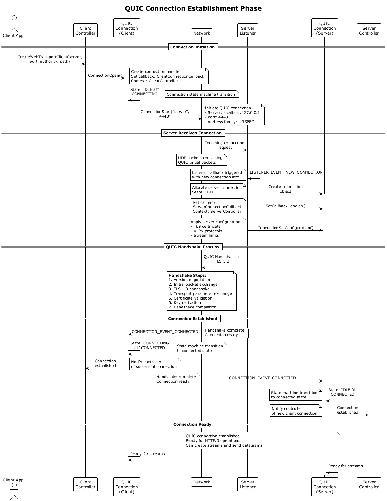

# QUIC/HTTP/3/WebTransport PlantUML Diagrams - Complete Reference

## Table of Contents
1. [Document Overview](#document-overview)
2. [Summary of Diagrams](#summary-of-diagrams)
3. [Key Insights from the Diagrams](#key-insights-from-the-diagrams)
4. [Practical Usage](#practical-usage)
5. [Component Dependencies](#component-dependencies)
6. [WebTransport Sequence](#webtransport-sequence)
7. [State Transitions](#state-transitions)
8. [Event Flow and Callbacks](#event-flow-and-callbacks)
9. [WebTransport Protocol Stack](#webtransport-protocol-stack)
10. [Implementation Checklist](#implementation-checklist)
11. [Testing Scenarios](#testing-scenarios)
12. [Performance Considerations](#performance-considerations)
13. [Troubleshooting Guide](#troubleshooting-guide)
14. [Conclusion](#conclusion)

## Document Overview
[Table of Contents](#table-of-contents)

This document provides a comprehensive set of PlantUML diagrams that document the complete QUIC/HTTP/3/WebTransport architecture. These diagrams serve as both implementation guides and debugging references for building WebTransport applications using Microsoft's MsQuic library.

---

## Summary of Diagrams
[Table of Contents](#table-of-contents)

There are five comprehensive PlantUML diagrams that document the complete QUIC/HTTP/3/WebTransport architecture:

### **1. Component Dependencies Diagram**
- Shows the hierarchical relationship between all components
- Maps WebTransport → HTTP/3 → QUIC → UDP layers
- Includes MsQuic object dependencies (Registration → Configuration → Listener/Connection → Stream)
- Annotates protocol standards (RFC 9220, 9114, 9000, 8446)
- Shows stream ID allocations and usage patterns

### **2. WebTransport Sequence Diagram**
- Complete client-server interaction flow
- Covers initialization, QUIC handshake, HTTP/3 settings, WebTransport CONNECT
- Shows all state transitions with triggers
- Includes both successful and error scenarios
- Details stream creation and data exchange
- Covers graceful shutdown sequence

### **3. State Transition Diagram**
- Four separate state machines: QUIC Connection, QUIC Stream, HTTP/3, WebTransport
- All valid state transitions with triggers
- Cross-layer dependencies and relationships
- Error states and recovery paths
- Entry and exit conditions

### **4. Event Flow and Callback Diagram**
- Complete MsQuic callback reference with triggers
- All 21 different event types across Listener, Connection, and Stream
- Required actions for each callback
- Error handling patterns
- State dependencies and cleanup requirements

### **5. WebTransport Protocol Stack Diagram**
- Detailed protocol layer mapping
- Message examples for CONNECT, responses, streams, datagrams
- Stream ID allocation rules and HTTP/3 usage patterns
- Error handling scenarios and recovery mechanisms
- Performance optimization features (0-RTT, migration, congestion control)

---

## Key Insights from the Diagrams
[Table of Contents](#table-of-contents)

### **Critical Dependencies:**
1. **Registration** must exist before any other MsQuic objects
2. **Configuration** must load credentials before connection use
3. **QUIC CONNECTED** state required before HTTP/3 operations
4. **HTTP/3 SETTINGS** exchange enables WebTransport capability
5. **WebTransport CONNECT + 200 OK** establishes session

### **Event Flow Patterns:**
1. **Initialization**: App → Controller → MsQuic → Network
2. **Incoming Data**: Network → MsQuic → Callback → App
3. **State Changes**: Trigger → State Machine → Actions → Next State
4. **Error Handling**: Error → Cleanup → State Transition → Recovery

### **Stream Lifecycle:**
```
IDLE → OPEN → [HALF_CLOSED_*] → CLOSED
  ↓      ↓           ↓            ↓
Create  Data     FIN/Reset    Cleanup
```

### **WebTransport Session Flow:**
```
INITIALIZING → CONNECTING → CONNECTED → CLOSING → CLOSED
     ↓             ↓           ↓           ↓         ↓
   Create      CONNECT     200 OK    Shutdown   Cleanup
```

---

## Practical Usage
[Table of Contents](#table-of-contents)

### **For Implementation:**
- Use the **component diagram** to understand object relationships
- Follow the **sequence diagram** for proper API call ordering
- Reference **state transitions** for valid state changes
- Use **event flow** to implement callbacks correctly

### **For Debugging:**
- **Sequence diagram** shows expected message flow
- **State transitions** help identify invalid state changes
- **Event flow** reveals missing or incorrect callbacks
- **Component dependencies** expose lifecycle issues

### **For Architecture:**
- **Component diagram** shows separation of concerns
- **Protocol stack** clarifies layer responsibilities
- **Dependencies** guide object lifetime management
- **Error scenarios** inform resilience design

---

## Protocol Compliance

- **RFC 9000** (QUIC): Connection, stream, and packet management
- **RFC 8446** (TLS 1.3): Security and handshake procedures
- **RFC 9114** (HTTP/3): Frame processing and stream usage
- **RFC 9220** (WebTransport): Session establishment and management

---

## Component Dependencies
[Table of Contents](#table-of-contents)


[🔍 View SVG](svg/quic-http3-webtransport-component_dependencies.svg)  
[🧾 View Source (.puml)](diagrams/quic-http3-webtransport-component_dependencies.puml)

### 1: Application Layer Components

Shows WebTransport and HTTP/3 applications


[🔍 View SVG](svg/comprehensive-components-application-layer.svg)  
[🧾 View Source (.puml)](diagrams/comprehensive-components-application-layer.puml)

### 2: WebTransport Protocol Components

Shows session, streams, and datagrams management


[🔍 View SVG](svg/comprehensive-components-webtransport-protocols.svg)  
[🧾 View Source (.puml)](diagrams/comprehensive-components-webtransport-protocols.puml)

### 3: HTTP/3 Protocol Components

Shows frame parsing, QPACK, and stream types


[🔍 View SVG](svg/comprehensive-components-http3-protocols.svg)  
[🧾 View Source (.puml)](diagrams/comprehensive-components-http3-protocols.puml)

### 4: MsQuic Layer Components

Shows all MsQuic API objects and relationships


[🔍 View SVG](svg/comprehensive-components-msquic-layer.svg)  
[🧾 View Source (.puml)](diagrams/comprehensive-components-msquic-layer.puml)

### 5: Transport Layer Components

Shows UDP and network interface details


[🔍 View SVG](svg/comprehensive-components-transport-layer.svg)  
[🧾 View Source (.puml)](diagrams/comprehensive-components-transport-layer.puml)

**Cross-Diagram Reference System**:

Each diagram uses interface elements with clear annotations to reference connections to other diagrams:

- **Interface Points**: interface "To/From [Layer] [Diagram]" elements
- **Reference Notes**: Clear annotations like "Reference: WebTransport Protocol Diagram"
- **Connection Descriptions**: Detailed notes explaining what data flows between layers

### 6: Overview Diagram

The 6th diagram provides a **high-level overview** showing how all 5 layers connect, with:

- **Simplified boxes** representing each layer
- **Cross-layer connections** with detailed annotations
- **Reference notes** pointing to individual detailed diagrams
- **Protocol specifications** (RFC numbers) for each layer


[🔍 View SVG](svg/comprehensive-components-dependencies-overview.svg)  
[🧾 View Source (.puml)](diagrams/comprehensive-components-dependencies-overview.puml)

## WebTransport Sequence
[Table of Contents](#table-of-contents)


[🔍 View SVG](svg/webtransport-over-quic-http3-complete-sequence.svg)  
[🧾 View Source (.puml)](diagrams/webtransport-over-quic-http3-complete-sequence.puml)

### 1: Initialization Phase


[🔍 View SVG](svg/webtransport-seq-initialization-phase.svg)  
[🧾 View Source (.puml)](diagrams/webtransport-seq-initialization-phase.puml)

### 2: QUIC Connection Establishment



[🔍 View SVG](svg/webtransport-seq-quic-connection-establishment.svg)  
[🧾 View Source (.puml)](diagrams/webtransport-seq-quic-connection-establishment.puml)

### 3: HTTP/3 Settings Exchange


[🔍 View SVG](svg/webtransport-seq-http3-settings-exchange.svg)  
[🧾 View Source (.puml)](diagrams/webtransport-seq-http3-settings-exchange.puml)

### 4: WebTransport CONNECT Request


[🔍 View SVG](svg/webtransport-seq-wt-connect-request.svg)  
[🧾 View Source (.puml)](diagrams/webtransport-seq-wt-connect-request.puml)

### 5: WebTransport Session Establishment


[🔍 View SVG](svg/webtransport-seq-wt-session-establishment.svg)  
[🧾 View Source (.puml)](diagrams/webtransport-seq-wt-session-establishment.puml)

### 6: WebTransport Data Exchange


[🔍 View SVG](svg/webtransport-seq-wt-data-exchange.svg)  
[🧾 View Source (.puml)](diagrams/webtransport-seq-wt-data-exchange.puml)

### 7: Graceful Shutdown


[🔍 View SVG](svg/webtransport-seq-graceful-shutdown.svg)  
[🧾 View Source (.puml)](diagrams/webtransport-seq-graceful-shutdown.puml)

## State Transitions
[Table of Contents](#table-of-contents)


[🔍 View SVG](svg/quic-http3-webtransport-state-transitions.svg)  
[🧾 View Source (.puml)](diagrams/quic-http3-webtransport-state-transitions.puml)

### 1: QUIC Connection State

**QUIC Connection States** (`quic_connection_states`)

- Complete state machine: IDLE → CONNECTING → CONNECTED → DRAINING → CLOSED → ERROR
- All original triggers preserved: ConnectionOpen(), CONNECTION_CONNECTED, etc.
- Enhanced annotations: TLS handshake details, cleanup actions, error conditions
- Cross-references: Points to dependent stream and protocol states


[🔍 View SVG](svg/discrete-state-quic-connection.svg)  
[🧾 View Source (.puml)](diagrams/discrete-state-quic-connection.puml)

### 2: QUIC Stream Transitions

**QUIC Stream States** (`quic_stream_states`)

- Full stream lifecycle: IDLE → OPEN → HALF_CLOSED_* → CLOSED → ERROR
- Bidirectional flow handling: Local and remote send directions
- Unidirectional stream support: Direct transitions to half-closed states
- Flow control annotations: Stream-level and connection-level controls
- Stream ID management: Client/server stream ID patterns


[🔍 View SVG](svg/discrete-state-quic-streams-transitions.svg)  
[🧾 View Source (.puml)](diagrams/discrete-state-quic-streams-transitions.puml)

### 3: HTTP/3 Layer State Transitions

**HTTP/3 Layer States** (`http3_layer_states`)

- Protocol initialization: INIT → SETTINGS_PENDING → READY → ERROR
- Settings exchange details: ENABLE_WEBTRANSPORT, SETTINGS_H3_DATAGRAM
- WebTransport enablement: Prerequisites for WebTransport sessions
- QPACK configuration: Header compression setup
- Error handling: Protocol violations and recovery


[🔍 View SVG](svg/discrete-state-http3-layer-transitions.svg)  
[🧾 View Source (.puml)](diagrams/discrete-state-http3-layer-transitions.puml)

### 4: WebTransport Session State Transitions

**WebTransport Session States** (`webtransport_session_states`)

- Session lifecycle: INITIALIZING → CONNECTING → CONNECTED → CLOSING → CLOSED
- CONNECT handshake: Detailed CONNECT request/response flow
- Session capabilities: Stream/datagram management when connected
- Graceful shutdown: CLOSE_WEBTRANSPORT_SESSION handling
- Failure modes: 4xx/5xx response handling and error recovery


[🔍 View SVG](svg/discrete-state-webtransport-session-transitions.svg)  
[🧾 View Source (.puml)](diagrams/discrete-state-webtransport-session-transitions.puml)

***Cross-Reference System***:

Each diagram includes interface annotations that reference other diagrams:

- **"Reference: [Diagram Name]"** notes that point to related state machines
- **Dependency arrows** showing which states enable others
- **Cross-layer interactions** clearly documented

### 5: Transitions Overview

**Overview Diagram Features**:

The **State Transitions Overview** provides:

- **Simplified state** representations for each layer
- **Cross-layer dependency arrows** with detailed annotations
- **Reference notes** pointing to individual detailed diagrams
- **Hierarchical relationship** explanation showing how layers depend on each other
- **Error propagation paths** showing how failures cascade
- **Layer characteristics** summary for each protocol layer


[🔍 View SVG](svg/discrete-state-transitions-overview.puml.svg)  
[🧾 View Source (.puml)](diagrams/discrete-state-transitions-overview.puml)

## Event Flow and Callbacks
[Table of Contents](#table-of-contents)


[🔍 View SVG](svg/msquic-event-flow-and-callback-triggers.svg)  
[🧾 View Source (.puml)](diagrams/msquic-event-flow-and-callback-triggers.puml)

### 1: Application Layer Event Flow

**Application Layer Event Flow (`application_layer_flow`)**

- **API Categories**: Registration, Configuration, Connection, Stream, Listener APIs
- **Application Responsibilities**: State management, error handling, resource cleanup
- **Cross-references**: Points to MsQuic Core and specific callback diagrams
- **Error Handling**: Application-level error recovery and cleanup strategies


[🔍 View SVG](svg/discrete-activity-application-layer.svg)  
[🧾 View Source (.puml)](diagrams/discrete-activity-application-layer.puml)

### 2: MsQuic Core Event Processing

**MsQuic Core Event Processing (`msquic_core_flow`)**

- Internal Processing: API validation, state updates, resource management
- Event Generation: Network events, timer events, state change events
- Network Processing: Packet parsing, frame processing, connection management
- Performance Features: Zero-copy networking, efficient memory management


[🔍 View SVG](svg/discrete-activity-msquic-core-event-processing.svg)  
[🧾 View Source (.puml)](diagrams/discrete-activity-msquic-core-event-processing.puml)

### 3: Listener Callback Processing

**Listener Callback Processing (`listener_callback_flow`) - EXPANDED & RESTRUCTURED**

- NEW_CONNECTION Processing: Detailed connection acceptance flow
  - Connection validation and filtering
  - SetCallbackHandler() requirements
  - ConnectionSetConfiguration() steps
  - Accept/reject decision logic
  
- STOP_COMPLETE Processing: Listener shutdown handling
- Clear Decision Points: Accept vs reject logic with proper status codes


[🔍 View SVG](svg/discrete-activity-listener-callback-processing.svg)  
[🧾 View Source (.puml)](diagrams/discrete-activity-listener-callback-processing.puml)

### 4: Connection Callback Processing

**Connection Callback Processing (`connection_callback_flow`) - EXPANDED & RESTRUCTURED**

- CONNECTED Event: Connection setup and initial stream creation
- PEER_STREAM_STARTED: Stream acceptance with uni/bidirectional handling
- DATAGRAM_RECEIVED: Unreliable datagram processing
- SHUTDOWN Events: Both transport and peer-initiated shutdown
- SHUTDOWN_COMPLETE: Critical ConnectionClose() requirement
- Switch Structure: Clear event type handling with detailed processing


[🔍 View SVG](svg/discrete-activity-connection-callback-processing.svg)  
[🧾 View Source (.puml)](diagrams/discrete-activity-connection-callback-processing.puml)

### 5: Stream Callback Processing

**Stream Callback Processing (`stream_callback_flow`) - NEW DEDICATED DIAGRAM**

- RECEIVE Processing: Data processing and mandatory StreamReceiveComplete()
- SEND_COMPLETE: Send completion handling and buffer management
- SHUTDOWN Events: Peer FIN, abort handling, and cleanup
- SHUTDOWN_COMPLETE: Critical StreamClose() requirement
- Flow Control: Emphasis on mandatory flow control compliance


[🔍 View SVG](svg/discrete-activity-stream-callback-processing.svg)  
[🧾 View Source (.puml)](diagrams/discrete-activity-stream-callback-processing.puml)

### 6: Overview Diagram

**Overview Diagram Benefits**:

The Event Flow Overview provides:

- High-level Architecture: Shows how all components interact
- Reference Navigation: Points to detailed diagrams for each component
- Performance Characteristics: Threading model and critical path operations
- Error Propagation: How errors flow through the system
- Resource Management: Proper cleanup and dependency handling


[🔍 View SVG](svg/discrete-activity-event-flow-overview.svg)  
[🧾 View Source (.puml)](diagrams/discrete-activity-event-flow-overview.puml)

## WebTransport Protocol Stack
[Table of Contents](#table-of-contents)


[🔍 View SVG](svg/webtransport-protocol-stack-and-message-flow.svg)  
[🧾 View Source (.puml)](diagrams/webtransport-protocol-stack-and-message-flow.puml)

---

## Implementation Checklist
[Table of Contents](#table-of-contents)

### **Based on Component Dependencies:**
- [ ] Initialize Registration before any other objects
- [ ] Load credentials in Configuration before connection use
- [ ] Set callbacks for Listener, Connection, and Stream objects
- [ ] Enable receive on bidirectional streams
- [ ] Handle all required callback events

### **Based on Sequence Diagram:**
- [ ] Follow proper initialization order (MsQuic → Registration → Configuration)
- [ ] Handle QUIC handshake completion before HTTP/3 operations
- [ ] Send/receive HTTP/3 SETTINGS frames for protocol negotiation
- [ ] Validate WebTransport CONNECT requests properly
- [ ] Implement graceful shutdown procedures

### **Based on State Transitions:**
- [ ] Implement state machines for Connection, Stream, and WebTransport Session
- [ ] Handle all valid state transitions
- [ ] Implement error recovery paths
- [ ] Ensure proper cleanup in all terminal states

### **Based on Event Flow:**
- [ ] Implement all required MsQuic callbacks
- [ ] Handle callback return values correctly
- [ ] Implement proper error handling for each event type
- [ ] Follow dependency cleanup order

### **Based on Protocol Stack:**
- [ ] Implement HTTP/3 frame parsing and generation
- [ ] Handle QPACK encoding/decoding for headers
- [ ] Manage stream ID allocation correctly
- [ ] Implement WebTransport-specific features (streams and datagrams)

---

## Testing Scenarios
[Table of Contents](#table-of-contents)

### **Connection Establishment:**
1. Successful QUIC handshake with valid certificate
2. TLS certificate validation failure
3. ALPN negotiation failure
4. Connection timeout scenarios

### **HTTP/3 Layer:**
1. SETTINGS frame exchange
2. Invalid frame handling
3. QPACK decoding errors
4. Control stream management

### **WebTransport Protocol:**
1. Valid CONNECT request processing
2. Invalid CONNECT request rejection
3. Session establishment and teardown
4. Multiple concurrent sessions

### **Stream Management:**
1. Bidirectional stream creation and data exchange
2. Unidirectional stream handling
3. Stream reset scenarios
4. Flow control handling

### **Error Handling:**
1. Network connectivity loss
2. Peer abrupt disconnection
3. Protocol violations
4. Resource exhaustion

---

## Performance Considerations
[Table of Contents](#table-of-contents)

### **Connection Level:**
- Use appropriate execution profiles (LOW_LATENCY vs MAX_THROUGHPUT)
- Configure optimal stream limits and flow control windows
- Enable 0-RTT for reduced connection establishment latency
- Implement connection migration for mobile scenarios

### **Stream Level:**
- Use appropriate send buffer sizes based on IDEAL_SEND_BUFFER_SIZE events
- Implement proper backpressure handling
- Consider stream prioritization for different data types
- Batch small sends to reduce overhead

### **Application Level:**
- Pool and reuse connections when possible
- Implement connection sharing for multiple WebTransport sessions
- Use datagrams for low-latency, loss-tolerant data
- Implement application-level flow control for large transfers

---

## Troubleshooting Guide
[Table of Contents](#table-of-contents)

### **Connection Issues:**
- Check certificate configuration and validity
- Verify firewall and network connectivity
- Review QUIC version compatibility
- Validate ALPN negotiation

### **Stream Issues:**
- Ensure callbacks are set before stream operations
- Check stream ID allocation and limits
- Verify receive enable status for bidirectional streams
- Review flow control window settings

### **WebTransport Issues:**
- Validate CONNECT request headers
- Check HTTP/3 SETTINGS exchange
- Verify stream type assignments
- Review session state management

### **Performance Issues:**
- Monitor congestion control behavior
- Check buffer sizes and memory usage
- Review thread pool configuration
- Analyze packet loss and retransmission patterns

---

## Conclusion
[Table of Contents](#table-of-contents)

These diagrams provide a complete reference for implementing WebTransport over QUIC using MsQuic, covering everything from low-level callback handling to high-level protocol flows. They serve as both implementation guides and debugging references for building robust, high-performance WebTransport applications.

The diagrams should be used together as a comprehensive system:
- **Component Dependencies** for understanding the overall architecture
- **Sequence Diagrams** for implementation flow
- **State Transitions** for proper state management
- **Event Flow** for callback implementation
- **Protocol Stack** for message handling
